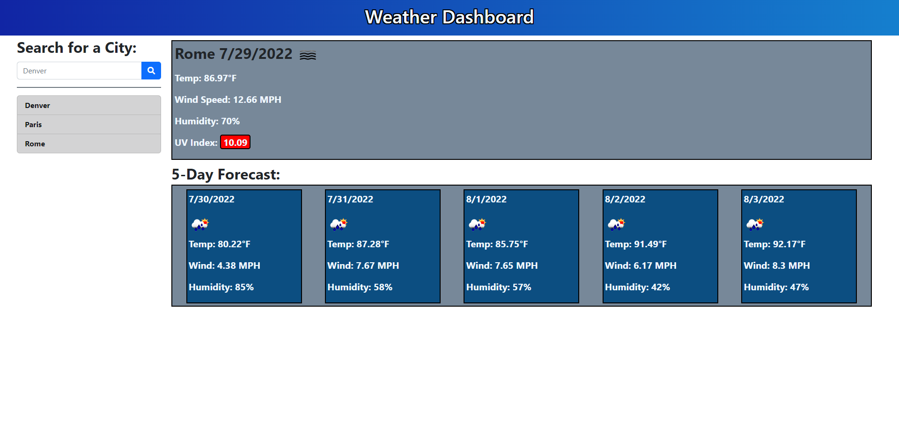

# Weather Dashboard

For this project, I was assigned to produce an app that allowed the user to input a city and get the current weather along with a five day forecast. Also, each city is saved to a search list that can be clicked to bring up that particular citie's weather.

## Skills Practiced

- Storing and accessing local storage.
- Use fetch to collect data from server API.
- Using a server API key to request data based on user input.
- Pulling relevent data from an API response
- Use 3rd party APIs such as fontawesome, and bootstrap for styleing.
- Use built in date API to show actual date.
- JS functions and loops.
- Change styleing dynamically.
- DEBUGGING.

## Screenshot of App

## Deployment URL

https://peoplesm.github.io/weather-dashboard/
